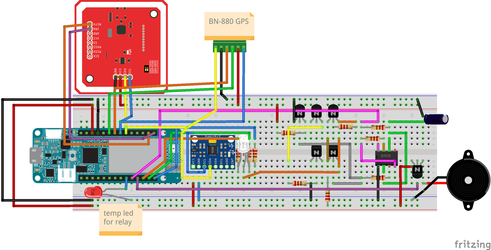

# GPS Bike Tracker

I want to create a gps tracker that's integrated into my e-bike to allow for GPS tracking and prevent e-bike functionality unless the bike is unlocked. I plan to create a tracker that will:

### Key features

- post its location to a web service (separate project);
- send SMS notifications
- have a backup battery and use the main e-bike battery as a power supply
- disable the motor until the bike has been unlocked by an RFID tag
- have an alarm and also run in a silent/low power mode
- motion detection

### Parts/modules

- MKR GSM 1400
- PN532 V3
- MPU6050

Separate 555 timer for blinking light during blocking operations

